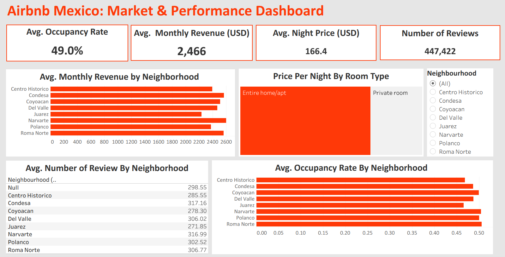

# 🏡 Airbnb Investment Opportunity Analysis — Mexico City  
**Python | SQL | Tableau | Data Analysis**

  

---

## 📌 Executive Summary

This project analyzes Airbnb market performance in Mexico City to identify high-potential neighborhoods for short-term rental investment.

Using structured KPI modeling and a composite ROI scoring system, the analysis evaluates demand strength, pricing power, occupancy stability, and competitive intensity to rank investment attractiveness across neighborhoods.

The project demonstrates end-to-end analytical workflow: data preparation, metric engineering, SQL-based aggregation, ROI modeling, and executive-level dashboard communication.

---

## 🎯 Business Problem

Real estate investors need data-driven answers to:

- Which neighborhoods show sustained booking demand?
- Where do listings achieve strong occupancy and pricing power?
- Which areas offer attractive returns with manageable competition?
- How should new listings be strategically positioned?

This analysis replaces intuition with structured, quantitative evaluation.

---

## 🧠 Analytical Approach

### 1️⃣ Data Preparation (Python)

- Multi-table dataset validation
- Data cleaning and type correction
- Feature engineering for occupancy and revenue metrics
- Demand proxy construction using review activity
- Neighborhood standardization

---

### 2️⃣ KPI Computation (SQL)

Neighborhood-level performance indicators:

- Average occupancy rate
- Average nightly price
- Estimated monthly revenue
- Active listing count (competition level)
- Reviews per listing (demand intensity)

SQL joins connected listings, calendar, and reviews data to produce structured market metrics.

---

### 3️⃣ Investment Scoring Model

A composite ROI score was built to rank neighborhoods.

The model integrates:

- Occupancy rate  
- Revenue potential  
- Competitive pressure (inverse weighting)

All metrics were normalized before weighting to ensure comparability.

The result is a relative investment attractiveness ranking across Mexico City neighborhoods.

---

## 📊 Key Insights

- **Roma Norte** leads in demand concentration and occupancy strength.
- **Narvarte and Polanco** demonstrate strong revenue generation capacity.
- Entire home/apartment listings outperform private rooms in pricing power.
- Demand-to-competition ratios reveal clearer investment positioning than raw revenue alone.

---

## 📈 Dashboard

The Tableau dashboard provides:

- Market-wide occupancy overview
- Revenue comparison by neighborhood
- Demand vs competition visualization
- Property-type pricing differentiation

  

---

## 💼 Business Impact

This project enables:

- Data-backed location selection  
- Risk mitigation through competition analysis  
- Revenue optimization via pricing strategy  
- Structured evaluation of short-term rental opportunities  

---

## 🛠 Tools & Skills Demonstrated

- Python (Pandas)
- SQL (Joins, Aggregations, KPI Design)
- Tableau (Data Visualization & Storytelling)
- ROI Modeling
- Business-Oriented Data Analysis

---

## 📂 Repository Structure
data/
processed/

notebooks/
sql/
dashboard/
reports/
assets/

README.md
.gitignore

---

## 📎 Project Files

- Cleaned datasets
- Jupyter Notebook (Python Analysis)
- SQL Script (KPI Computation)
- Tableau Dashboard (.twb)
- Final Analytical Report (PDF)

---

### Author  
Erick Hernández  
Data Analytics Portfolio Project
